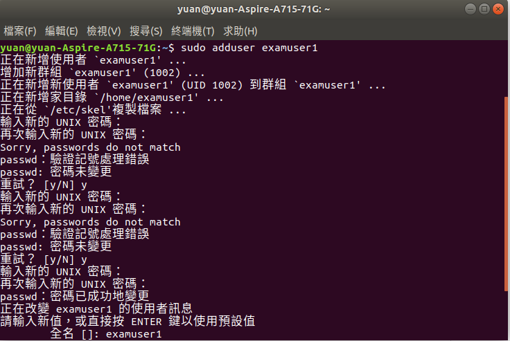
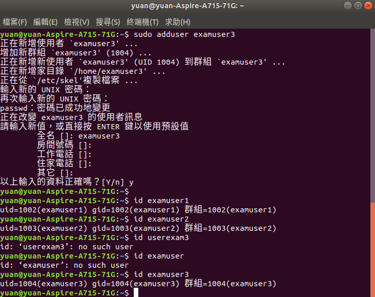
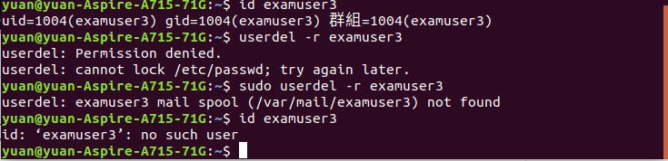
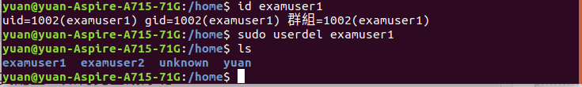
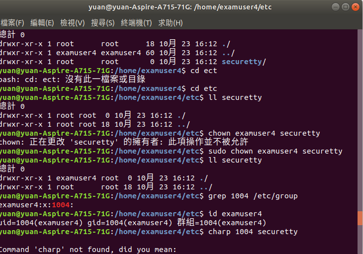
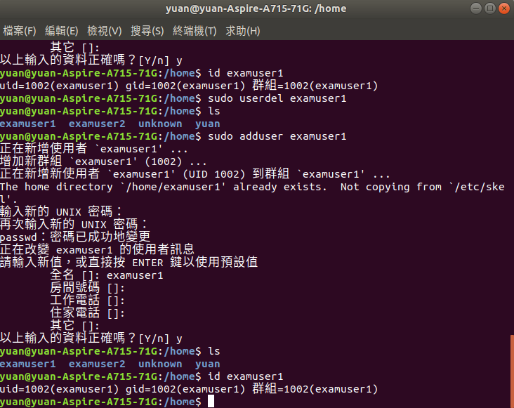
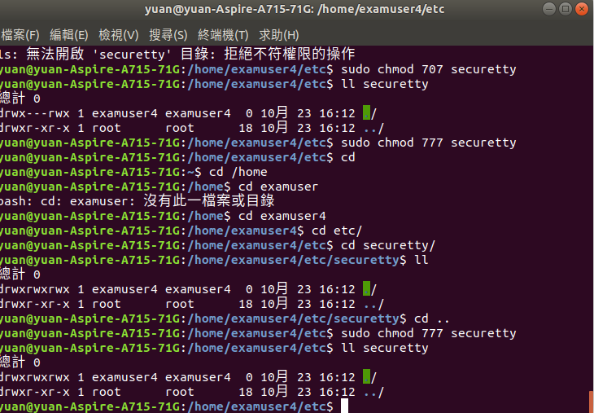
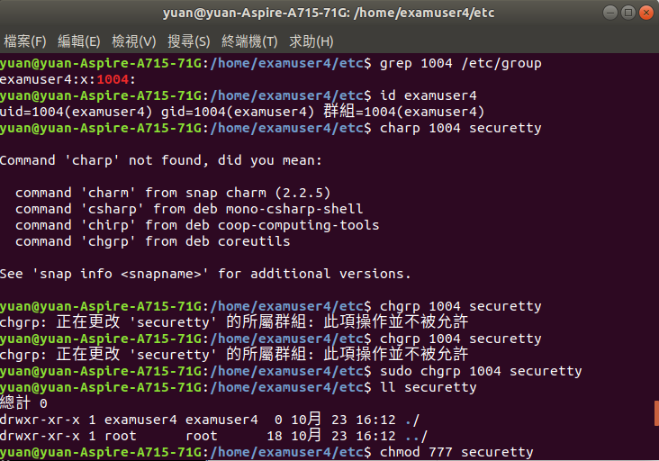
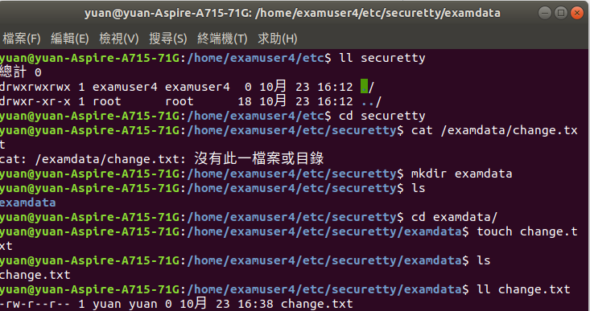
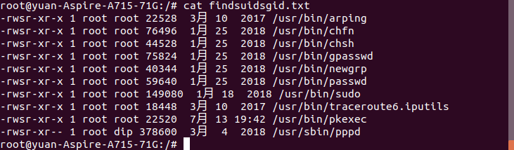

# HW4
### 使用ubuntu

1 

* 建立群組 mygroup、nogroup，grep查看group是否存在 
<pre><code>groupadd mygroup
grep mygroup /etc/group</code></pre>
 
* 建立帳號 myuser1~3，加入 mygroup，密碼為 MyPassWord，2、3以此類推 
<pre><code>useradd -m -G mygroup myuser1
passwd myuser1</code></pre>
 
* 建立帳號 nouser1~3，加入 nogroup，密碼為 MyPassWord，2、3以此類推 
<pre><code>useradd -m -G nogroup myuser1
passwd nouser1</code></pre>
  
* 切換至myuser1 前往 /srv/myproject 建 myproject.data 
先更改權限 
<pre>chgrp mygroup myproject
chmod 770 myproject</pre>
 
再進入 myuser1 
<pre>touch myproject.data</pre>
 
* 復制/usr/bin/ls至/usr/local/bin/myls... 
<pre>cp -r /usr/bin/ls /local/bin/myls
chmod 4755 myls</pre>
 

2 
<pre>ps aux | grep rsyslog
ps aux | grep rsyslog > /root/preocess_syslog.txt
cat /root/process_syslog.txt</pre>
grep 分類查詢 
>重新導向至後面內容 
cat 查看後面檔案內容 
 

3 
<pre>find /usr/bin -perm /u=s</pre>
find 是主要使用的搜尋指令 後面加查詢事物 
-perm 是指定檔案權限 
/u=s 即為 含有SUID的特殊檔案 
 
<pre>find /usr/bin -perm /u=s -ok ls -l > findsuidsgid.txt
find /usr/bin -perm /u=s -ok ls -l 1>> findsuidsgid.txt</pre>
兩句差別在 > 1>> 
上面是顯示每筆，下面則是顯示一筆 
 
<pre>cat findsuidsgid.txt</pre>
 
